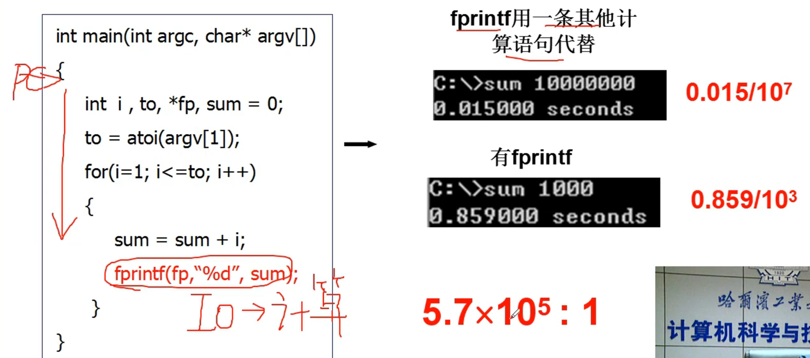

cpu是最核心的部件，操作系统在管理cpu的时候才引出了多进程图像    

----

###### cpu的工作原理   

给cpu一个地址，然后cpu从里面取出来执行       

      
然后PC自动累加，cpu就自动取指令执行          

cpu的工作就是取指-执行   

----

###### 管理CPU的最直观方法      
      
然后PC自动加1，取下一条指令到IR     

###### 这样做是有问题的，先看下面有IO和没IO执行时间的差距        
     

可以看到IO指令执行起来特别慢      

大概执行一条IO指令的时间可以执行10的6次方条计算指令了   

看下图： 如果就给cpu个PC的起点然后让他一条条执行下去，那样等到执行到IO的时候，计算就要等IO执行完，而两个的时间是1：1,此时cpu的利用率是50%    
    

而我们知道，就拿我们的算法来说，一个for循环可能就计算个几十条指令，如果这时候加个IO操作的话，我们cpu的利用率就是30/10^6，接近于0了，要等太久了    

所以我们不能让cpu就这样执行下去，最直观的管理办法还有很多优化的空间   

于是我们可以在等IO的过程中也可以做别的事情       

我们一条程序在等的时候cpu可以切出去到其他地方工作，然后这个工作执行不下去了可以切回来，或者等中断然后又回去     

cpu一直切来切去，就可以提高cpu的利用率了    

     

**多道程序、交替执行**    
    
让cpu可以去这边执行也能去那边执行，让cpu忙碌起来（看多道程序的图）      

# 一个cpu上交替的执行多个程序：并发   

###### 怎么做到并发？   
在切换的时候我们需要存放当前的信息，这样回来的时候才知道之前看了什么   

于是引出了进程的概念:进程是进行中的程序      

切换程序要记录的东西存放在PCB中   

进程有开始有结束，程序没有   
进程会走走婷婷，走停对程序无意义   
进程需要记录ax（累加器：主要用于存放数据，也可临时用于存放地址），bx（基址寄存器：常用来存放访问存储器时的地址），...程序不用   

# 总结：   
* 让cpu工作起来：    
启动一个进程，让cpu去执行这个进程    

* 让cpu更好的工作起来  ：   
操作系统需要启用多个进程，cpu去跑多个进程，就很好的管理了cpu，提高了cpu的利用率    

所以多个进程向前跑的样子就应该是管理cpu的核心样子，这就是**多进程图像**    

